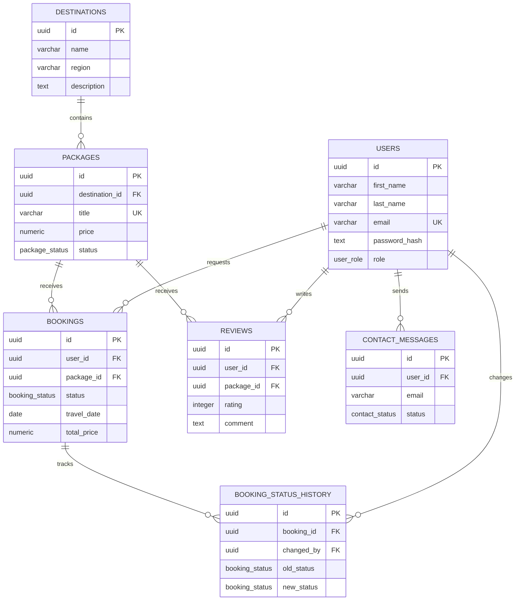

# Entity Relationship Diagram

Use this diagram as the project ERD reference. For final submission, export the same relationship structure from pgAdmin as an image and add it to the README if your instructor requires a pgAdmin image specifically.

